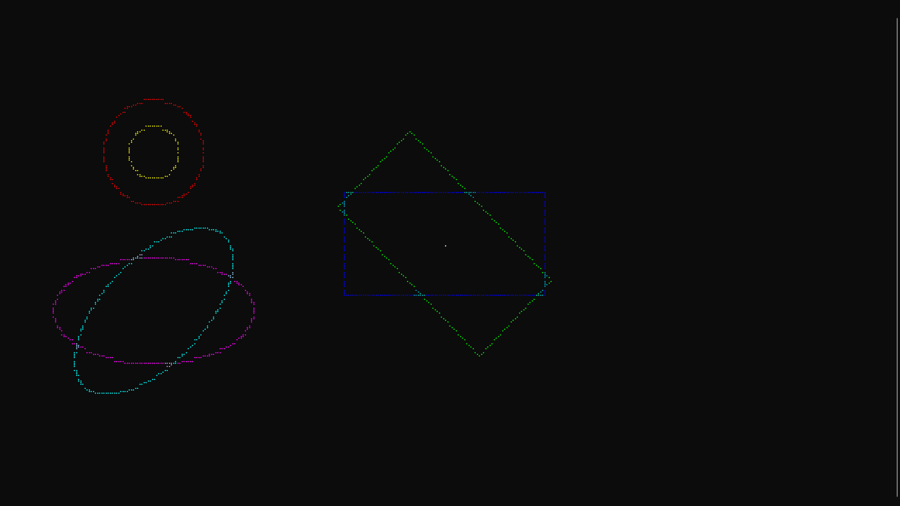

# LuvitTG

Proof-of-concept terminal graphics library for [Luvit](https://luvit.io).

Supports immediate-mode drawing of 2D primitives using [braille patterns](https://en.wikipedia.org/wiki/Braille_Patterns) or [block elements](https://en.wikipedia.org/wiki/Block_Elements).

Includes abstractions for vectors, transforms, and colors.

Work-in-progress.

See also:
- https://github.com/asciimoo/drawille
- https://github.com/asciimoo/lua-drawille
- https://github.com/madbence/node-drawille

